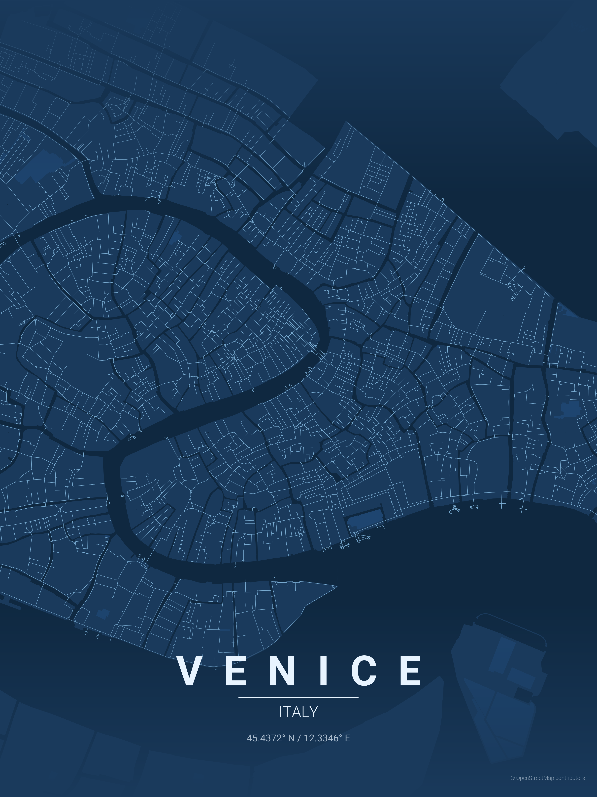

# City Map Poster Generator

Generate beautiful, minimalist map posters for any city in the world.


## Examples

| Country      | City           | Theme           | Poster |
|:------------:|:--------------:|:---------------:|:------:|
| USA          | San Francisco  | sunset          |  |
| Spain        | Barcelona      | warm_beige      |  |
| Italy        | Venice         | blueprint       |  |
| Japan        | Tokyo          | japanese_ink    |  |
| India        | Mumbai         | contrast_zones  |  |
| Morocco      | Marrakech      | terracotta      |  |
| Singapore    | Singapore      | neon_cyberpunk  |  |
| Australia    | Melbourne      | forest          |  |
| UAE          | Dubai          | midnight_blue   |  |
| USA          | Seattle        | emerald         |  |

## Installation

> Requires Python **3.11+** (matches the versions validated in CI).

### With uv (Recommended)

Make sure [uv](https://docs.astral.sh/uv/) is installed. Running `uv run` automatically creates and manages a virtual environment.

```bash
# First run will automatically install dependencies
uv run maptoposter-cli --city "Paris" --country "France"

# Or sync dependencies explicitly first (using locked versions)
uv sync --locked
uv run maptoposter-cli --city "Paris" --country "France"
```

### With pip + venv

```bash
python -m venv .venv
source .venv/bin/activate  # On Windows: .venv\Scripts\activate
pip install -r requirements.txt
```

To regenerate `requirements.txt` from `pyproject.toml`, run `./scripts/sync_requirements.sh` (wraps `uv pip compile`).

### Install from Git or wheel

When consuming this package from another repository, either install directly from Git:

```bash
pip install "git+https://github.com/EfrenPy/maptoposter.git@main"
```

or build a wheel once and install the artifact:

```bash
uv build
pip install dist/maptoposter-*.whl
```

See `CONSUMERS.md` for end-to-end instructions (editable installs, tagged releases, and CI notes).

### Fonts Cache

Custom Google Fonts requested via `--font-family` are cached under `~/.cache/maptoposter/fonts` by default (override with `MAPTOPOSTER_FONTS_CACHE`). Drop any `.woff2`/`.ttf` assets there to avoid repeated downloads in CI or air-gapped environments.

## Usage

### Generate Poster

If you're using `uv`:

```bash
uv run maptoposter-cli --city <city> --country <country> [options]
```

Otherwise (pip + venv):

```bash
maptoposter-cli --city <city> --country <country> [options]
```

> **Legacy compatibility:** `maptoposter-cli ...` still works if you prefer calling the script directly.

### Programmatic Usage

Call the renderer from Python without the CLI:

```python
from maptoposter import PosterGenerationOptions, generate_posters

options = PosterGenerationOptions(city="Paris", country="France", theme="terracotta")
generate_posters(options)
```

A convenience wrapper builds a poster in one call:

```python
from maptoposter import PosterGenerationOptions, create_poster_from_options

options = PosterGenerationOptions(city="Paris", country="France", dpi=150)
create_poster_from_options(options, "terracotta")
```

**Progress streaming** — pass an `on_progress` callback to receive status events:

```python
from maptoposter import PosterGenerationOptions, generate_posters
from maptoposter._util import StatusReporter

def progress_handler(event: str, message: str, extra: dict):
    print(f"[{event}] {message}")

reporter = StatusReporter(on_progress=progress_handler)
options = PosterGenerationOptions(city="Paris", country="France")
generate_posters(options, status_reporter=reporter)
```

**Parallel multi-theme rendering** from Python:

```python
from maptoposter import PosterGenerationOptions, generate_posters

options = PosterGenerationOptions(
    city="Tokyo", country="Japan",
    all_themes=True, parallel_themes=True, max_theme_workers=8,
)
generate_posters(options)
```

**Batch processing** from Python:

```python
from maptoposter import run_batch

result = run_batch("cities.csv", global_overrides={"output_dir": "posters/"})
print(f"{len(result['successes'])} posters generated, {len(result['failures'])} failures")

# Parallel batch processing
result = run_batch("cities.csv", parallel=True, max_workers=8)
```

> See `examples/basic_python_usage.py` for a ready-to-run snippet that writes posters into `examples/output/` and logs JSON progress.

## Testing

Install the development extras, then run pytest:

```bash
uv pip install '.[dev]'  # once
uv run pytest
```

These tests rely on lightweight fixtures that mock geocoding results and synthetic OSM data, so they run quickly without network access.

### Config Files

Pass a JSON or YAML file via `--config` to predefine CLI options (any CLI flag can be set with the same snake_case key). CLI flags always override the config file when both are provided.

```yaml
city: Paris
country: France
themes:
  - terracotta
  - neon_cyberpunk
distance: 9000
paper_size: A2
orientation: landscape
output_dir: /tmp/posters
no_attribution: true
```

You can still combine individual flags, e.g. `maptoposter-cli --config poster.yaml --width 14 --log-format json`. A starter config lives in `examples/config/poster.yaml` and mirrors every CLI option.

### Structured Logging & Metadata

- Use `--log-format json` to emit newline-delimited JSON events describing progress (`run.start`, `poster.save.complete`, etc.), perfect for machine parsing.
- Every generated poster now produces a sibling metadata file (`<poster>.json`) containing city/country, theme, DPI, coordinates, timestamps, and attribution flags for audit/billing.
- Direct poster output anywhere via `--output-dir` or the `MAPTOPOSTER_OUTPUT_DIR` environment variable (defaults to `posters/`).

### Consuming from Other Projects

Install directly from PyPI:

```bash
pip install maptoposter
```

For development, use an editable install:

```bash
cd /path/to/maptoposterpage
pip install -e ../maptoposter
```

For immutable builds, run `uv build` or `pip install .` to produce/install a wheel.

### Required Options

| Option | Short | Description |
|--------|-------|-------------|
| `--city` | `-c` | City name (used for geocoding) |
| `--country` | `-C` | Country name (used for geocoding) |

### Optional Flags

| Option | Short | Description | Default |
|--------|-------|-------------|---------|
| **OPTIONAL:** `--latitude` | `-lat` | Override latitude center point (use with --longitude) | |
| **OPTIONAL:** `--longitude` | `-long` | Override longitude center point (use with --latitude) | |
| **OPTIONAL:** `--country-label` | | Override country text displayed on poster | |
| **OPTIONAL:** `--theme` | `-t` | Theme name | terracotta |
| **OPTIONAL:** `--distance` | `-d` | Map radius in meters | 18000 |
| **OPTIONAL:** `--list-themes` | | List all available themes | |
| **OPTIONAL:** `--all-themes` | | Generate posters for all available themes | |
| **OPTIONAL:** `--width` | `-W` | Image width in inches | 12 (max: 20) |
| **OPTIONAL:** `--height` | `-H` | Image height in inches | 16 (max: 20) |
| **OPTIONAL:** `--paper-size` | `-p` | Paper size preset: A0, A1, A2, A3, A4 (overrides width/height) | |
| **OPTIONAL:** `--orientation` | `-o` | Paper orientation: portrait, landscape | portrait |
| **OPTIONAL:** `--dpi` | | Output DPI (auto-reduced if memory would exceed 2 GB) | 300 |
| **OPTIONAL:** `--no-attribution` | | Hide the OpenStreetMap attribution text | |
| **OPTIONAL:** `--format` | `-f` | Output format: png, svg, pdf | png |
| **OPTIONAL:** `--parallel-themes` | | Render multiple themes in parallel (multiprocessing) | off |
| **OPTIONAL:** `--batch` | | CSV or JSON file for batch poster generation | |
| **OPTIONAL:** `--parallel` | | Process batch cities in parallel (multiprocessing) | off |
| **OPTIONAL:** `--max-workers` | | Max parallel workers for batch processing | 4 |
| **OPTIONAL:** `--gallery` | | Generate an HTML gallery after rendering | |
| **OPTIONAL:** `--cache-clear` | | Delete all cached OSM data and exit | |
| **OPTIONAL:** `--cache-info` | | Print cache statistics and exit | |

### Multilingual Support - i18n

Display city and country names in your language with custom fonts from google fonts:

| Option | Short | Description |
|--------|-------|-------------|
| `--display-city` | `-dc` | Custom display name for city (e.g., "東京") |
| `--display-country` | `-dC` | Custom display name for country (e.g., "日本") |
| `--font-family` | | Google Fonts family name (e.g., "Noto Sans JP") |

**Examples:**

```bash
# Japanese
maptoposter-cli -c "Tokyo" -C "Japan" -dc "東京" -dC "日本" --font-family "Noto Sans JP"

# Korean
maptoposter-cli -c "Seoul" -C "South Korea" -dc "서울" -dC "대한민국" --font-family "Noto Sans KR"

# Arabic
maptoposter-cli -c "Dubai" -C "UAE" -dc "دبي" -dC "الإمارات" --font-family "Cairo"
```

**Note**: Fonts are automatically downloaded from Google Fonts and cached locally under `~/.cache/maptoposter/fonts` (override with `MAPTOPOSTER_FONTS_CACHE`).

### Paper Size Presets

Use `--paper-size` (`-p`) for standard print-ready sizes. Combine with `--orientation` (`-o`) for landscape.

| Size | Portrait (inches) | Landscape (inches) | Pixels @ 300 DPI | Pixels @ 600 DPI |
|------|-------------------|--------------------|--------------------|-------------------|
| **A0** | 33.1 x 46.8 | 46.8 x 33.1 | 9,930 x 14,040 | 19,860 x 28,080 |
| **A1** | 23.4 x 33.1 | 33.1 x 23.4 | 7,020 x 9,930 | 14,040 x 19,860 |
| **A2** | 16.5 x 23.4 | 23.4 x 16.5 | 4,950 x 7,020 | 9,900 x 14,040 |
| **A3** | 11.7 x 16.5 | 16.5 x 11.7 | 3,510 x 4,950 | 7,020 x 9,900 |
| **A4** | 8.3 x 11.7 | 11.7 x 8.3 | 2,490 x 3,510 | 4,980 x 7,020 |

```bash
# A2 portrait poster
maptoposter-cli -c "Paris" -C "France" -p A2

# A3 landscape poster
maptoposter-cli -c "Tokyo" -C "Japan" -p A3 -o landscape

# High-resolution A2 at 600 DPI
maptoposter-cli -c "London" -C "UK" -p A2 --dpi 600

# A4 PDF for print shop
maptoposter-cli -c "Berlin" -C "Germany" -p A4 -f pdf

# A0 large format poster
maptoposter-cli -c "New York" -C "USA" -p A0 --dpi 300
```

### DPI Guide

| DPI | Quality | Best for |
|-----|---------|----------|
| 150 | Draft | Quick previews |
| 300 | Standard | Standard print quality |
| 600 | High | Professional prints |
| 1200 | Very high | Large format / archival |

> **Note:** Higher DPI increases memory usage and generation time significantly, especially for large paper sizes (A0, A1). For vector formats (PDF, SVG), DPI is capped at 300 since they are resolution-independent and scale perfectly at any size.

### Resolution Guide (custom sizes at 300 DPI)

Use these values for `-W` and `-H` to target specific resolutions:

| Target | Resolution (px) | Inches (-W / -H) |
|--------|-----------------|------------------|
| **Instagram Post** | 1080 x 1080 | 3.6 x 3.6 |
| **Mobile Wallpaper** | 1080 x 1920 | 3.6 x 6.4 |
| **HD Wallpaper** | 1920 x 1080 | 6.4 x 3.6 |
| **4K Wallpaper** | 3840 x 2160 | 12.8 x 7.2 |

### Usage Examples

#### Basic Examples

```bash
# Simple usage with default theme
maptoposter-cli -c "Paris" -C "France"

# With custom theme and distance
maptoposter-cli -c "New York" -C "USA" -t noir -d 12000
```

#### Multilingual Examples (Non-Latin Scripts)

Display city names in their native scripts:

```bash
# Japanese
maptoposter-cli -c "Tokyo" -C "Japan" -dc "東京" -dC "日本" --font-family "Noto Sans JP" -t japanese_ink

# Korean
maptoposter-cli -c "Seoul" -C "South Korea" -dc "서울" -dC "대한민국" --font-family "Noto Sans KR" -t midnight_blue

# Thai
maptoposter-cli -c "Bangkok" -C "Thailand" -dc "กรุงเทพมหานคร" -dC "ประเทศไทย" --font-family "Noto Sans Thai" -t sunset

# Arabic
maptoposter-cli -c "Dubai" -C "UAE" -dc "دبي" -dC "الإمارات" --font-family "Cairo" -t terracotta

# Chinese (Simplified)
maptoposter-cli -c "Beijing" -C "China" -dc "北京" -dC "中国" --font-family "Noto Sans SC"

# Khmer
maptoposter-cli -c "Phnom Penh" -C "Cambodia" -dc "ភ្នំពេញ" -dC "កម្ពុជា" --font-family "Noto Sans Khmer"
```

#### Advanced Examples

```bash
# Iconic grid patterns
maptoposter-cli -c "New York" -C "USA" -t noir -d 12000           # Manhattan grid
maptoposter-cli -c "Barcelona" -C "Spain" -t warm_beige -d 8000   # Eixample district

# Waterfront & canals
maptoposter-cli -c "Venice" -C "Italy" -t blueprint -d 4000       # Canal network
maptoposter-cli -c "Amsterdam" -C "Netherlands" -t ocean -d 6000  # Concentric canals
maptoposter-cli -c "Dubai" -C "UAE" -t midnight_blue -d 15000     # Palm & coastline

# Radial patterns
maptoposter-cli -c "Paris" -C "France" -t pastel_dream -d 10000   # Haussmann boulevards
maptoposter-cli -c "Moscow" -C "Russia" -t noir -d 12000          # Ring roads

# Organic old cities
maptoposter-cli -c "Tokyo" -C "Japan" -t japanese_ink -d 15000    # Dense organic streets
maptoposter-cli -c "Marrakech" -C "Morocco" -t terracotta -d 5000 # Medina maze
maptoposter-cli -c "Rome" -C "Italy" -t warm_beige -d 8000        # Ancient layout

# Coastal cities
maptoposter-cli -c "San Francisco" -C "USA" -t sunset -d 10000    # Peninsula grid
maptoposter-cli -c "Sydney" -C "Australia" -t ocean -d 12000      # Harbor city
maptoposter-cli -c "Mumbai" -C "India" -t contrast_zones -d 18000 # Coastal peninsula

# River cities
maptoposter-cli -c "London" -C "UK" -t noir -d 15000              # Thames curves
maptoposter-cli -c "Budapest" -C "Hungary" -t copper_patina -d 8000  # Danube split

# Override center coordinates
maptoposter-cli --city "New York" --country "USA" -lat 40.776676 -long -73.971321 -t noir

# List available themes
maptoposter-cli --list-themes

# Generate posters for every theme
maptoposter-cli -c "Tokyo" -C "Japan" --all-themes
```

### Batch Mode

Generate multiple posters from a CSV or JSON file in one invocation:

```bash
maptoposter-cli --batch cities.csv
```

**CSV format** — must include `city` and `country` columns; optional columns: `theme`, `distance`, `dpi`, `width`, `height`, `format`, `display_city`, `display_country`, `font_family`.

```csv
city,country,theme,distance
Paris,France,terracotta,9000
Tokyo,Japan,japanese_ink,15000
New York,USA,noir,12000
```

**JSON format** — a list of objects (or `{"cities": [...]}`) with the same keys:

```json
[
  {"city": "Paris", "country": "France", "theme": "terracotta"},
  {"city": "Tokyo", "country": "Japan", "theme": "japanese_ink"}
]
```

### HTML Gallery

After generating posters, produce a self-contained HTML gallery page:

```bash
maptoposter-cli --batch cities.csv --gallery
```

The gallery is written to the output directory as `index.html` and displays all PNG/SVG/PDF posters with their metadata (city, theme, dimensions) in a responsive CSS grid.

### Parallel Rendering

Speed up multi-theme and batch workflows with multiprocessing. Data fetching and graph projection are hoisted out of the theme loop automatically (no flag needed), so generating multiple themes for the same city only downloads OSM data once.

```bash
# Render all 17 themes in parallel for one city
maptoposter-cli -c "Tokyo" -C "Japan" --all-themes --parallel-themes

# Process batch cities in parallel (default: 4 workers)
maptoposter-cli --batch cities.csv --parallel

# Batch with 8 workers + parallel themes + gallery
maptoposter-cli --batch cities.csv --parallel --max-workers 8 --parallel-themes --gallery
```

> **Note:** Parallel rendering uses `ProcessPoolExecutor` (multiprocessing, not threads) because matplotlib is not thread-safe. Each worker runs in its own process. Default behavior is sequential for backward compatibility; parallelism is opt-in via `--parallel-themes` and `--parallel`.

### Cache Management

OSM data and geocoding results are cached locally with TTL (7 days for map data, 30 days for coordinates). Manage the cache with:

```bash
# Show cache statistics (file count, total size)
maptoposter-cli --cache-info

# Delete all cached data
maptoposter-cli --cache-clear
```

### Auto DPI Reduction

If the requested DPI would cause memory usage to exceed 2 GB, the DPI is automatically reduced to the highest safe value (minimum 72). A warning is emitted when this occurs.

### Distance Guide

| Distance | Best for |
|----------|----------|
| 4000-6000m | Small/dense cities (Venice, Amsterdam center) |
| 8000-12000m | Medium cities, focused downtown (Paris, Barcelona) |
| 15000-20000m | Large metros, full city view (Tokyo, Mumbai) |

## Themes

17 themes ship with the package (override via `MAPTOPOSTER_THEMES_DIR`):

| Theme | Style |
|-------|-------|
| `gradient_roads` | Smooth gradient shading |
| `contrast_zones` | High contrast urban density |
| `noir` | Pure black background, white roads |
| `midnight_blue` | Navy background with gold roads |
| `blueprint` | Architectural blueprint aesthetic |
| `neon_cyberpunk` | Dark with electric pink/cyan |
| `warm_beige` | Vintage sepia tones |
| `pastel_dream` | Soft muted pastels |
| `japanese_ink` | Minimalist ink wash style |
| `emerald`      | Lush dark green aesthetic |
| `forest` | Deep greens and sage |
| `ocean` | Blues and teals for coastal cities |
| `terracotta` | Mediterranean warmth |
| `sunset` | Warm oranges and pinks |
| `autumn` | Seasonal burnt oranges and reds |
| `copper_patina` | Oxidized copper aesthetic |
| `monochrome_blue` | Single blue color family |

## Output

Posters are saved to `posters/` by default (`MAPTOPOSTER_OUTPUT_DIR` or `--output-dir` can override). Filenames follow:

```text
{city}_{theme}_{YYYYMMDD_HHMMSS}.png
```

Each poster is accompanied by `{city}_{theme}_{timestamp}.json`, a metadata file capturing coordinates, DPI, size, theme, attribution flags, and timestamps for downstream billing/auditing.

## Adding Custom Themes

Create a JSON file in `themes/` directory:

```json
{
  "name": "My Theme",
  "description": "Description of the theme",
  "bg": "#FFFFFF",
  "text": "#000000",
  "gradient_color": "#FFFFFF",
  "water": "#C0C0C0",
  "parks": "#F0F0F0",
  "road_motorway": "#0A0A0A",
  "road_primary": "#1A1A1A",
  "road_secondary": "#2A2A2A",
  "road_tertiary": "#3A3A3A",
  "road_residential": "#4A4A4A",
  "road_default": "#3A3A3A"
}
```

## Project Structure

```text
maptoposter/
├── create_map_poster.py    # Legacy wrapper (calls maptoposter-cli)
├── Dockerfile              # Multi-stage Docker build
├── src/
│   └── maptoposter/
│       ├── __init__.py     # Public programmatic API
│       ├── _util.py        # StatusReporter, _emit_status, CacheError
│       ├── batch.py        # CSV/JSON batch processing
│       ├── cli.py          # CLI entry point (maptoposter-cli)
│       ├── core.py         # Rendering + data fetching helpers
│       ├── font_management.py  # Font loading and Google Fonts integration
│       ├── gallery.py      # HTML gallery generator
│       ├── geocoding.py    # Nominatim geocoding with tenacity retries
│       ├── rendering.py    # Figure setup, render layers, typography
│       ├── themes/         # Packaged themes (override via MAPTOPOSTER_THEMES_DIR)
│       └── fonts/          # Bundled Roboto fonts
├── posters/                # Generated posters
└── README.md
```


## Docker

A `Dockerfile` is provided for containerized usage:

```bash
docker build -t maptoposter .
docker run --rm -v "$PWD/posters:/home/maptoposter/posters" maptoposter --city "Paris" --country "France"
```

Pre-built images are pushed to `ghcr.io/efrenpy/maptoposter` on each GitHub release.

## Hacker's Guide

Quick reference for contributors who want to extend or modify the script.

### Contributors Guide

- Bug fixes are welcomed
- Don't submit user interface (web/desktop)
- If you vibe code any fix please test it and see before and after version of poster
- Before embarking on a big feature please ask in Discussions/Issue if it will be merged

### Architecture Overview

```text
┌─────────────────┐     ┌──────────────┐     ┌─────────────────┐
│   CLI Parser    │────▶│  Geocoding   │────▶│  Data Fetching  │
│   (argparse)    │     │  (Nominatim) │     │    (OSMnx)      │
└─────────────────┘     └──────────────┘     └─────────────────┘
                                                     │
                        ┌──────────────┐             ▼
                        │    Output    │◀────┌─────────────────┐
                        │  (matplotlib)│     │   Rendering     │
                        └──────────────┘     │  (matplotlib)   │
                                             └─────────────────┘
```

### Key Functions

| Function | Purpose | Modify when... |
|----------|---------|----------------|
| `get_coordinates()` | City → lat/lon via Nominatim | Switching geocoding provider |
| `create_poster()` | Main rendering pipeline | Adding new map layers |
| `get_edge_colors_by_type()` | Road color by OSM highway tag | Changing road styling |
| `get_edge_widths_by_type()` | Road width by importance | Adjusting line weights |
| `create_gradient_fade()` | Top/bottom fade effect | Modifying gradient overlay |
| `load_theme()` | JSON theme → dict | Adding new theme properties |
| `is_latin_script()` | Detects script for typography | Supporting new scripts |
| `load_fonts()` | Load custom/default fonts | Changing font loading logic |

### Rendering Layers (z-order)

```text
z=11  Text labels (city, country, coords)
z=10  Gradient fades (top & bottom)
z=3   Roads (via ox.plot_graph)
z=2   Parks (green polygons)
z=1   Water (blue polygons)
z=0   Background color
```

### OSM Highway Types → Road Hierarchy

```python
# In get_edge_colors_by_type() and get_edge_widths_by_type()
motorway, motorway_link     → Thickest (1.2), darkest
trunk, primary              → Thick (1.0)
secondary                   → Medium (0.8)
tertiary                    → Thin (0.6)
residential, living_street  → Thinnest (0.4), lightest
```

### Typography & Script Detection

The script automatically detects text scripts to apply appropriate typography:

- **Latin scripts** (English, French, Spanish, etc.): Letter spacing applied for elegant "P  A  R  I  S" effect
- **Non-Latin scripts** (Japanese, Arabic, Thai, Korean, etc.): Natural spacing for "東京" (no gaps between characters)

Script detection uses Unicode ranges (U+0000-U+024F for Latin). If >80% of alphabetic characters are Latin, spacing is applied.

### Adding New Features

**New map layer (e.g., railways):**

```python
# In create_poster(), after parks fetch:
try:
    railways = ox.features_from_point(point, tags={'railway': 'rail'}, dist=dist)
except:
    railways = None

# Then plot before roads:
if railways is not None and not railways.empty:
    railways.plot(ax=ax, color=THEME['railway'], linewidth=0.5, zorder=2.5)
```

**New theme property:**

1. Add to theme JSON: `"railway": "#FF0000"`
2. Use in code: `THEME['railway']`
3. Add fallback in `load_theme()` default dict

### Typography Positioning

All text uses `transform=ax.transAxes` (0-1 normalized coordinates):

```text
y=0.14  City name (spaced letters for Latin scripts)
y=0.125 Decorative line
y=0.10  Country name
y=0.07  Coordinates
y=0.02  Attribution (bottom-right)
```

### Useful OSMnx Patterns

```python
# Get all buildings
buildings = ox.features_from_point(point, tags={'building': True}, dist=dist)

# Get specific amenities
cafes = ox.features_from_point(point, tags={'amenity': 'cafe'}, dist=dist)

# Different network types
G = ox.graph_from_point(point, dist=dist, network_type='drive')  # roads only
G = ox.graph_from_point(point, dist=dist, network_type='bike')   # bike paths
G = ox.graph_from_point(point, dist=dist, network_type='walk')   # pedestrian
```

### Performance Tips

- Large `dist` values (>20km) = slow downloads + memory heavy
- Cache coordinates locally to avoid Nominatim rate limits
- Use `network_type='drive'` instead of `'all'` for faster renders
- Use `--dpi 150` for quick previews, `--dpi 600` or higher for print quality
- Use `--parallel-themes` when generating multiple themes for the same city (renders in parallel via multiprocessing)
- Use `--parallel` for batch processing to render cities concurrently
- Data fetching and graph projection are automatically hoisted when generating multiple themes, avoiding redundant downloads
